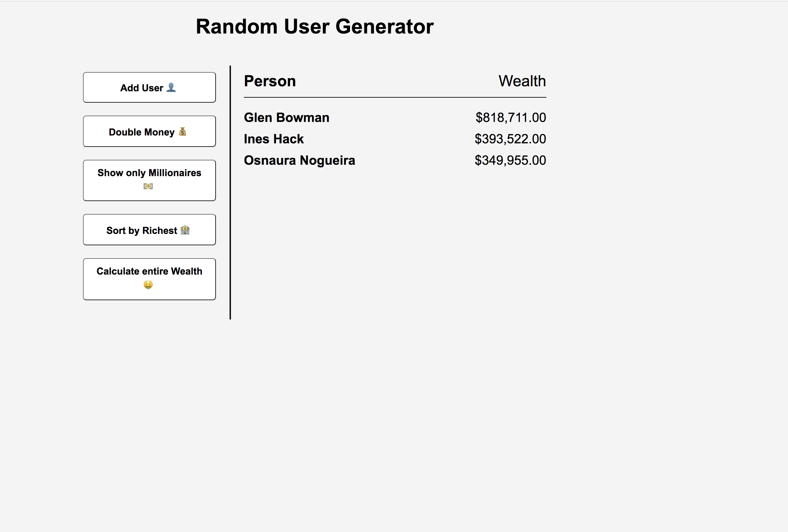
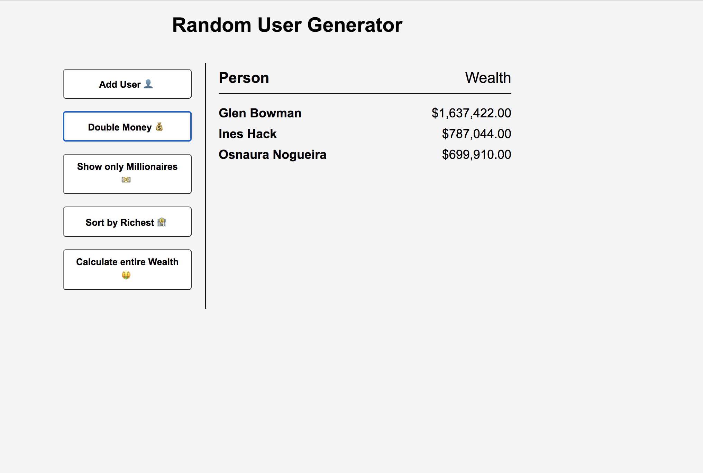
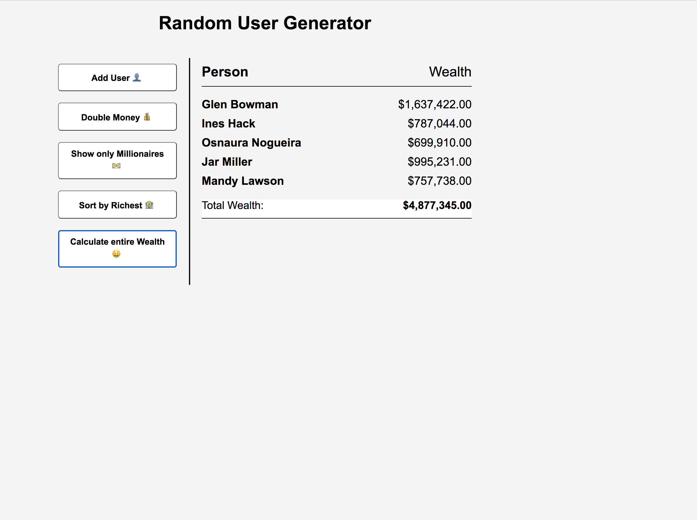

# Random-User-Generator-Project

## Description 

This is a random user generator that uses the public API from randomuser.me and the Array methods. Using fetch request, I used the five most common DOM array methods. Map(), reduce(), filter(), sort(), and forEach(). 

## Installation

As for installation, just fork the project and you should be able to run in your desktop. 

## Sample image 

There are a few sample images that can be viewed below. 

